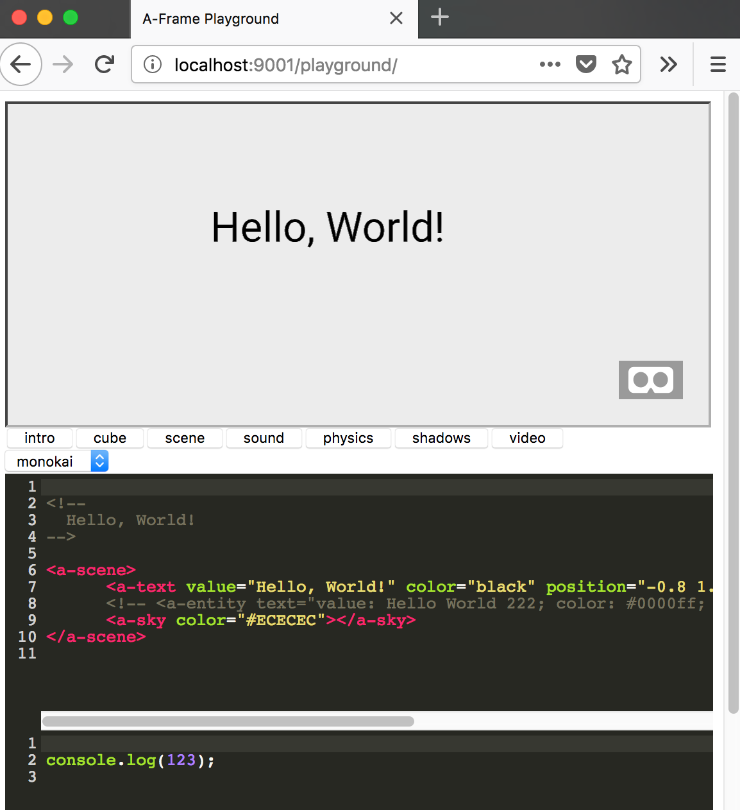

# A-Frame Playground

The A-Frame playground gives you a tool, to load a presentation of a number of example HTML files and click through them while showing code and result in one view. Made for educational purposes to teach [A-Frame](https://aframe.io/) but can also be used with standard HTML.

You can try a [demo here](https://curious-electric.com/w/experiments/aframe/aframe-playground/playground).


## Installation
Download the zip und unzip it or clone into the project. To use it you need to run a simple HTTP Server in the main directory.

On Unix-type OSes you can usually use ```python -m SimpleHTTPServer 9001``` .

If you prefer NodeJS, you can install a web server with

    npm install http-server -g
    http-server -p 9001

After that, you should be able to open ```http://localhost:9001/playground``` and see this:




## Features

- fast loading of both code and render of HTML/JS on the click
- code editing via [CodeMirror](https://codemirror.net/)
- hot reloading
- no server sided components (only the web server)
- works on mobile devices

There are a number of features that could be implemented additionally ( file save, autocompletion etc) but I felt the feature set was sufficient for my use case. Feel free to create issues to discuss more features.

## Adapt

To use your own example files, prepare them by adding a ```<!--START-->``` and ```<!--END--> ``` to the HTML which you want to showcase (see an example [here](https://github.com/dirkk0/aframe-playground/blob/master/examples/cube.html)).

Then put them into the examples directory and add them to the examples array [here](https://github.com/dirkk0/aframe-playground/blob/master/playground/index.html#L55).

## How it works

Everything is done in client-sided JavaScript; the code examples are split into the distinct code views, reassambled once the code is edited, and reloaded into an iFrame.

