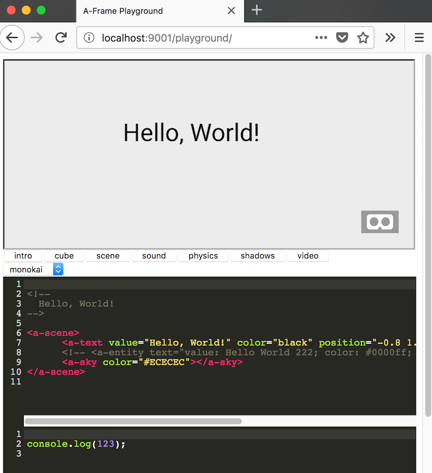

# aframe-playground

The AFrame playground gives you a tool, to load a presentation with a number of example HTML files and click through them while showing code and result in one view.

## Installation
Download the zip or clone into the project.

To use it you need to use a simple HTTP Server. On Unix-type OSes you can use
```python -m SimpleHTTPServer 9001```. If you have NodeJS installed, chances are that this works:
```http-server -p 9001```.

If not, you can install it with 

    npm install http-server -g

After that, you should be able to open ```http://localhost:9001/playground``` and see this:



